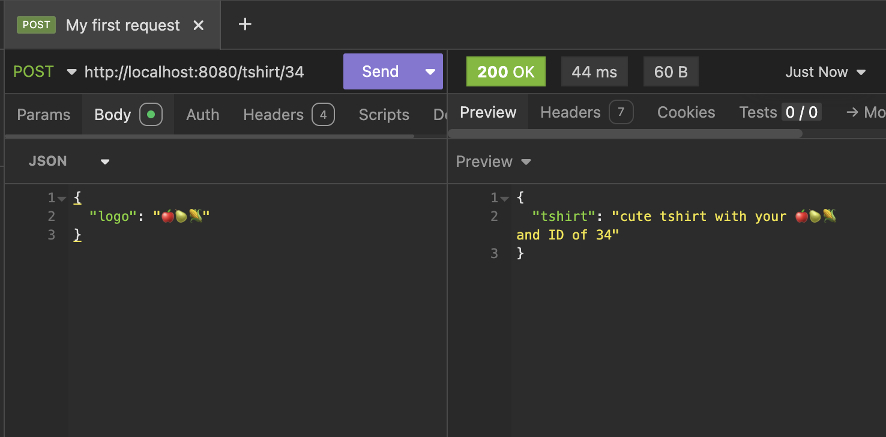

# Building APIs with Node.js

A simple Express.js API project demonstrating basic REST API endpoints for t-shirt management.

## Overview

This project showcases fundamental API development concepts using Node.js and Express.js. It includes examples of GET and POST endpoints with request handling, parameter extraction, and response formatting.

## Features

- **GET Endpoint**: Retrieve t-shirt information
- **POST Endpoint**: Create custom t-shirts with logos
- **Request Validation**: Basic input validation for required fields
- **JSON Middleware**: Automatic JSON parsing for request bodies

## API Endpoints

### GET /tshirt
Retrieves basic t-shirt information.

**Response:**
```json
{
  "tshirt": "cute tshirt",
  "size": "medium"
}
```

### POST /tshirt/:id
Creates a custom t-shirt with a specified logo.

**Parameters:**
- `id` (path parameter): T-shirt ID

**Request Body:**
```json
{
  "logo": "your-logo-text"
}
```

**Example Request:**


**Response:**
```json
{
  "tshirt": "cute tshirt with your your-logo-text and ID of 123"
}
```

**Error Response (if logo is missing):**
```json
{
  "message": "We need a logo!"
}
```
Status Code: 418

## Installation

1. Clone the repository:
```bash
git clone <repository-url>
cd buildingapis
```

2. Install dependencies:
```bash
npm install
```

## Usage

1. Start the server:
```bash
node index.js
```

2. The server will start on port 8080. You should see:
```
Server is running on port 8080
```

3. Test the endpoints:

**GET Request:**
```bash
curl http://localhost:8080/tshirt
```

**POST Request:**
```bash
curl -X POST http://localhost:8080/tshirt/123 \
  -H "Content-Type: application/json" \
  -d '{"logo": "my-awesome-logo"}'
```

## Project Structure

```
buildingapis/
├── img/              # Example images and screenshots
│   └── POST.png      # POST request example
├── index.js          # Main server file
├── package.json      # Project dependencies and scripts
├── package-lock.json # Dependency lock file
└── README.md         # Project documentation
```

## Dependencies

- **Express.js** (^5.1.0): Web framework for Node.js

## Development

This project serves as a learning resource for:
- Setting up Express.js servers
- Creating RESTful API endpoints
- Handling HTTP methods (GET, POST)
- Working with request parameters and body
- Implementing basic validation
- Structuring API responses


## License

ISC
